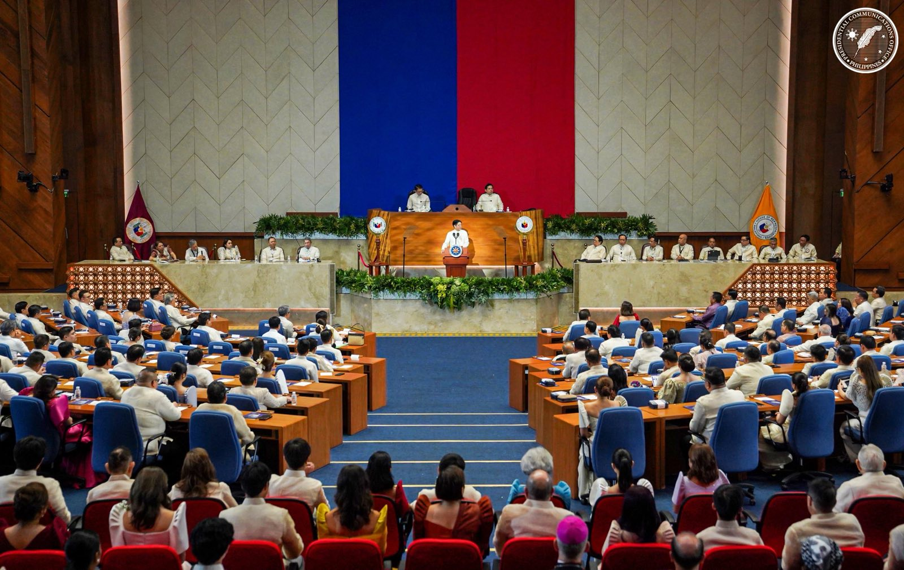

<strong>
    <h2>
        Take on SONA July 2025 of Pres. Ferdinand R. Marcos Jr.
        by Isaiah Gael D. Bato and 9-Lithium
    </h2>
</strong>
<strong><h3> A few key points I found interesting: </h3></strong>
- Marcos said that rice will become 20 pesos without farmers losing profit.
 - I also found the fact that Marcos wanted Filipino citizens to have better lifestyles, specifically participating in things like Zumba classes quite interesting.
 - I also found it interesting that Marcos said that he would increase the amount of jobss in the Philippines
 
 
<strong><h3> A few key points I found weird were: </h3></strong>
- I found it quite weird that Marcos wanted to plant specifically more coconut trees. For me, this should already be a given, and they should be planning to plant more trees and crops in general, not just for the coconut industry.
 
 
<strong><h3> My reflection: </h3></strong>
Marcos promised a lot of things this year. He made a lot of bold claims such as increasing the number of jobs, trying to improve the livelihood of Filipinos by decreasing prices and reducing poverty, and supporting small businesses. For me, these claims are truly doable. The Philippine government should be able to carry these out.
 
 
Since these are bold claims, I do hope that the government can manage their funds. The Philippines is in a dire state right now. We need to be able to start progressing. Marcos is often claimed to not be a good president, so I truly hope that he will be able to turn these views around.
 
 
<strong><h3> My word/sentence/phrase after hearing the SONA: </h3></strong>
Looking forward to what Marcos does.
 

